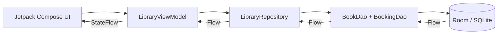
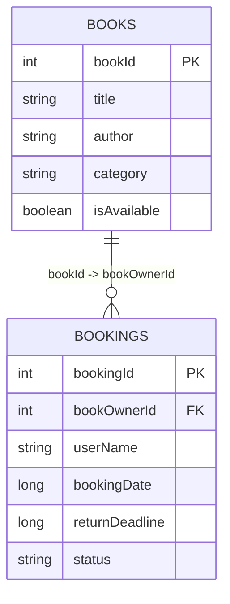

# Kitabu - MADB372 SF1

Kitabu is a native Android Library Book Rental & Reservation System created for **MADB372 Mobile Application Development B - SF1 (2026)**. It uses Kotlin, Jetpack Compose (Material 3), Room, KSP, Coroutines, Kotlin Flow, StateFlow and a clean MVVM architecture.

## Assessment coverage

| Requirement | Implementation |
|---|---|
| Responsive catalog | `CatalogScreen` uses a `LazyColumn` with Material 3 cards |
| Title/author/category/status | `BookCard` displays all required book metadata and availability badges |
| Dynamic search/filter | Search is driven by Room `LIKE` queries and an `Available only` filter |
| Reservation action | Tapping an available book opens a `ModalBottomSheet` with 7/14/21/28-day options |
| Reservation dashboard | `ReservationsScreen` displays pending and active bookings in a `LazyColumn` |
| Reservation date/deadline/days remaining | `BookingCard` shows all three values |
| Renew | Active rentals can extend the deadline by 7 days |
| Return | Active rentals can be returned and the book becomes available again |
| Cancel | Pending reservations can be deleted before pickup and the book becomes available again |
| Navigation Compose | Single activity + `NavHost`, `NavController`, `composable` destinations |
| Reactive state | Room `Flow` -> Repository -> ViewModel `StateFlow` -> `collectAsStateWithLifecycle()` |
| BookEntity / BookingEntity | Implemented with a CASCADE foreign key and enum status converter |
| CRUD | Insert/read/search/update/delete operations are provided by `BookDao`/`BookingDao` |
| Singleton database | Thread-safe `KitabuDatabase.getInstance()` |
| Pre-population | 8 sample academic books are inserted in the Room `onCreate` callback |
| Coroutines | Database writes are launched from `viewModelScope` and DAO writes are `suspend` functions |
| Input validation | User names and rental periods are validated before reservation; deadline checks are enforced |
| Logical packages | `ui/`, `data/`, `di/`, `domain/` |

## Architecture



### Source structure

```text
app/src/main/java/com/stadiolinks/kitabu/
├── data/
│   ├── local/          # Room entities, DAOs, converters and database
│   └── repository/     # Atomic rental lifecycle operations
├── di/                 # AppContainer
├── domain/             # ViewModel and UI state
└── ui/
    ├── components/     # Reusable BookCard and BookingCard
    ├── navigation/     # NavHost and bottom navigation
    ├── screens/        # Catalog, reservation sheet and dashboard
    └── theme/          # Material 3 colours/theme
```

## Database model



`BookingEntity.bookOwnerId` references `BookEntity.bookId` with `CASCADE` deletion. `BookingStatus` is persisted with a Room `@TypeConverter` as `PENDING`, `ACTIVE` or `RETURNED`.

## Rental lifecycle

1. A user browses or searches the catalog.
2. An available book opens a reservation bottom sheet.
3. Reserving creates a `PENDING` booking and immediately sets the book to unavailable inside a Room transaction.
4. `Collect` changes the booking to `ACTIVE`.
5. Active rentals can be renewed or returned.
6. Returning marks the booking `RETURNED` and makes the book available again in the same transaction.
7. Pending reservations can be cancelled; the booking is deleted and the book becomes available again.

## Current dependency configuration

- Android Gradle Plugin: 9.0.1
- Gradle distribution: 9.1.0
- Compile / target SDK: 36
- Minimum SDK: 26
- Java: 17
- Compose BOM: 2026.09.00
- Room: 2.8.5
- Navigation Compose: 2.10.1
- Lifecycle: 2.11.0
- Activity Compose: 1.13.0
- KSP: 2.3.10

AGP 9 provides built-in Kotlin support, so the project does not apply the old `org.jetbrains.kotlin.android` plugin. KSP is used for Room annotation processing.

## Run in Android Studio

1. Open Android Studio **Quail 1 (2026.1.1) or newer**.
2. Select **Open** and choose the `Kitabu_MADB372_SF1` folder.
3. Ensure SDK Platform 36 and JDK 17+ are installed.
4. Allow Gradle sync to finish.
5. If Android Studio asks to regenerate the Gradle wrapper JAR, allow it. The generated package includes the wrapper properties but not the binary JAR.
6. Run the `app` configuration on an emulator/device running API 26 or newer.
7. Test reserve -> collect -> renew -> return and reserve -> cancel.


## Prototype visual evidence

These images document the planned UI and are included in the Word report. They are **not a substitute for authentic emulator screenshots**. After running the app, capture live screenshots and add them to the Word document before Canvas submission.


## Screenshot evidence required for submission

The assignment requires live app screenshots in `StudName_MADB372_SF1.docx`. After running the project, capture at least:

- Book Catalog with availability badges
- Dynamic search/filter result
- Reservation bottom sheet
- Pending reservation dashboard
- Active rental dashboard
- Renewed deadline
- Returned book showing `Available` again
- Cancelled pending reservation showing `Available` again

Prototype images in `docs/screenshots/` are **visual design evidence only** and must not be presented as live emulator screenshots.

## GitHub submission

Create a **public** GitHub repository and push this full project. Paste the repository URL into the Word documentation before submission.

Suggested commands:

```bash
git init
git add .
git commit -m "Complete MADB372 SF1 Kitabu app"
git branch -M main
git remote add origin https://github.com/YOUR_USERNAME/Kitabu_MADB372_SF1.git
git push -u origin main
```

## References

- Android Developers. *Guide to app architecture*. https://developer.android.com/topic/architecture
- Android Developers. *Jetpack Compose*. https://developer.android.com/develop/ui/compose
- Android Developers. *Room*. https://developer.android.com/training/data-storage/room
- Android Developers. *Navigation with Compose*. https://developer.android.com/develop/ui/compose/navigation
- Android Developers. *Lifecycle-aware state collection*. https://developer.android.com/develop/ui/compose/state
- Kotlin Documentation. *Kotlin Coroutines and Flow*. https://kotlinlang.org/docs/coroutines-overview.html
- Kotlin Documentation. *Kotlin Symbol Processing (KSP)*. https://kotlinlang.org/docs/ksp-overview.html
